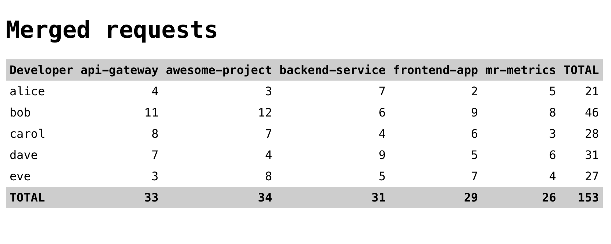

<!--
SPDX-FileCopyrightText: 2025 Danila Gorelko <hello@danilax86.space>

SPDX-License-Identifier: MIT
-->

# GitLab merged requests metrics table

A simple web application that shows a [developer × repository] table of merged MRs.

# Roadmap

Logic:

- [x] Make issuing GitLab requests via cron, not by "/" endpoint
- [x] When requesting "/" endpoint, get data directly from database without making requests to GitLab
- [x] Support of getting statistic up to provided date
- [ ] Support of getting statistic's diff between provided dates
- [ ] Topic support instead of providing project names

For contributors:

- [ ] Create a nice README
    - [ ] How to set up
    - [ ] How to run
    - [ ] How to contribute
    - [x] Roadmap
- [x] Add a license
    - [x] License text at the top of each file perhaps?)
- [x] Add Dockerfile for local development
- [ ] Add Devcontainer support (we live in a modern era, c'mon)
- [x] Add labels for issues

For code quality:

- [ ] Setup linters
- [ ] Bot, that advices to bump versions of dependencies
- [ ] Disable merging by people, only by bot that applies checks before merging just in time
